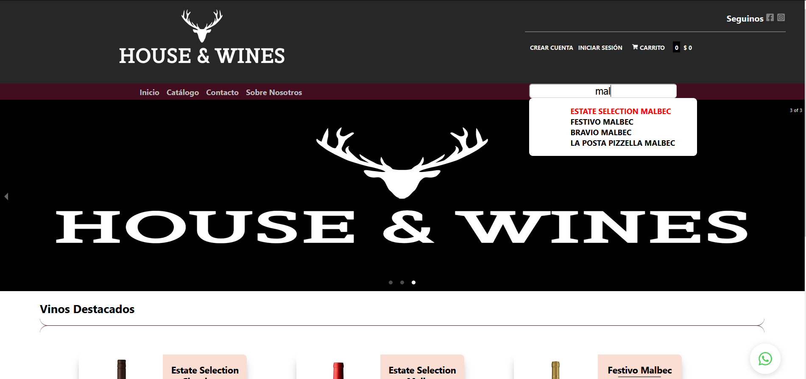
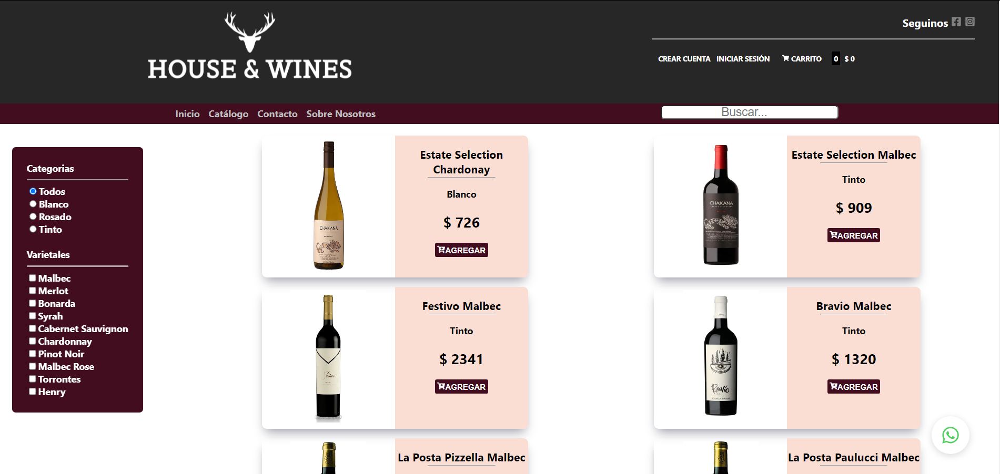
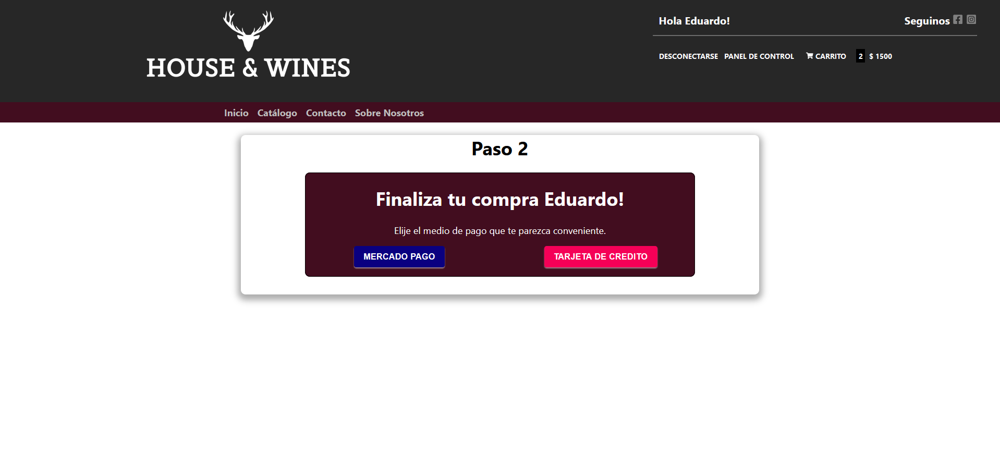
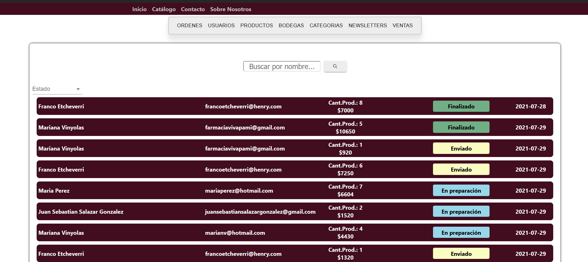

    

# E-Commerce
- Proyecto Final realizado en equipo como instancia evaluativa en [Soy Henry](https://www.soyhenry.com/) 
- Realizamos un e-commerce de venta de vinos, en el cual se pueden ver, buscar y filtrar vinos. Se pueden realizar compras tanto con mercadopago o tarjeta de credito, dejar review, ver detalles,etc. Y tambien como admin se pueden administrar tanto los productos, como los estados de las ordenes y los usuarios.
- [LINK](https://howclient.herokuapp.com/)

## Tecnologías utilizadas :computer: 

* __Javascript__
* __React - Redux__
* __Styled-Component__
* __Material-UI__
* __Node.Js__
* __Express__
* __MongoDB / Mongoose__
 

## Previews 🍷

    

    

    

    

